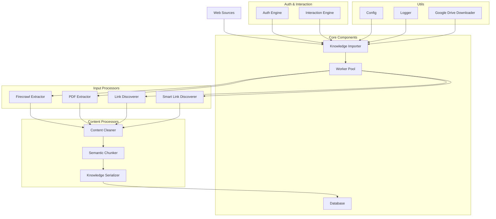

# Web Scraper

A powerful web scraping tool designed to automatically ingest technical knowledge from blogs, guides, and PDFs into a knowledge base. Built with TypeScript and Node.js, it leverages Firecrawl for efficient web crawling and various processors for content extraction and processing.

## Product Architecture



### Component Description

1. **Core Components**
   - Knowledge Importer: Orchestrates the entire knowledge ingestion process
   - Worker Pool: Manages concurrent processing tasks
   - Database: Handles data persistence and retrieval

2. **Input Processors**
   - Firecrawl Extractor: Handles web crawling and content extraction
   - PDF Extractor: Processes PDF documents
   - Link Discoverer: Basic link extraction
   - Smart Link Discoverer: Advanced link discovery with AI assistance

3. **Content Processors**
   - Content Cleaner: Normalizes and sanitizes extracted content
   - Semantic Chunker: Breaks content into meaningful segments
   - Knowledge Serializer: Prepares data for storage

4. **Auth & Interaction**
   - Auth Engine: Manages authentication for protected resources
   - Interaction Engine: Handles external service communication

5. **Utils**
   - Config: Manages application configuration
   - Logger: Handles logging and monitoring
   - Google Drive Downloader: Facilitates Google Drive integration

## Initial Setup

1. **Clone the Repository**
```bash
git clone https://github.com/Sharathchenna/web-scraper
cd web-scraper
npm install
```

2. **Environment Setup**
```bash
cp .env.example .env
```
- Open the `.env` file and update:
  - `GEMINI_API_KEY` with your API key
  - `DEFAULT_TEAM_ID` as needed

3. **Build the Project**
```bash
npm run build
```

4. **Setup Firecrawl (Required)**
- Ensure Docker is running on your system
```bash
git clone https://github.com/mendableai/firecrawl
cd firecrawl
docker compose up
```

### CLI Usage
The project includes a CLI tool that can be used with:
```bash
scrape [command] [options]
```

#### Available Commands

1. **Single URL Extraction**
```bash
scrape single <url> --team <teamId> [options]

Options:
  --team <teamId>     Team ID for the knowledge base (required)
  --user <userId>     User ID for the knowledge base items
  --output <dir>      Output directory for results
  --verbose           Enable verbose logging
```

2. **Website Crawling**
```bash
scrape crawl <rootUrl> --team <teamId> [options]

Options:
  --team <teamId>         Team ID for the knowledge base (required)
  --user <userId>         User ID for the knowledge base items
  --depth <depth>         Maximum crawl depth (default: 3)
  --max-pages <pages>     Maximum number of pages to crawl (default: 50)
  --exclude <patterns>    Patterns to exclude from crawling
  --include <patterns>    Patterns to include in crawling
  --output <dir>         Output directory for results
  --verbose              Enable verbose logging
```

3. **Legacy URL Command (Deprecated)**
```bash
scrape url <rootUrl> --team <teamId> [options]
# ⚠️ Deprecated: Use 'single' or 'crawl' commands instead
```

#### Example Usage

```bash
# Extract content from a single URL
scrape single https://example.com/blog-post --team team123 --output ./output

# Crawl a website with custom depth and max pages
scrape crawl https://example.com --team team123 --depth 5 --max-pages 100 --output ./output

# Crawl with exclude patterns
scrape crawl https://example.com --team team123 --exclude "**/admin/**" "**/login/**"
```

## Requirements

- Node.js >= 20.0.0
- Docker (for Firecrawl)

## Project Structure
```
internship-assignment-2/
├── data/               # Data storage
├── logs/              # Application logs
├── output/            # Output files and summaries
├── src/
│   ├── cli.ts         # CLI implementation
│   ├── core/          # Core functionality
│   ├── processors/    # Content processors
│   ├── schemas/       # Data schemas
│   ├── types/         # TypeScript type definitions
│   └── utils/         # Utility functions
├── test/              # Test files
└── temp/              # Temporary files
```

## Dependencies

### Main Dependencies
- `@google/genai` - Google's Generative AI SDK
- `@mendable/firecrawl-js` - Web crawling engine
- `playwright` - Browser automation
- `pdf-parse` - PDF parsing
- `winston` - Logging

### Development Dependencies
- TypeScript
- Jest for testing
- ESLint for linting
- Prettier for code formatting

## License

MIT License - see LICENSE file for details
