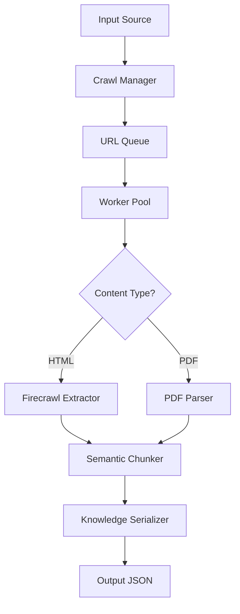

# Aline Knowledge Importer

Automatically ingest technical knowledge from blogs, guides, and PDFs into your Aline knowledge base with zero site-specific scraping logic.

## 🚀 Features

- **Universal Web Scraping**: Works out-of-the-box on most blogs using Firecrawl
- **PDF Processing**: Extract and chunk content from PDF documents
- **Intelligent Chunking**: Split large documents at semantic boundaries (headers, sentences)
- **Schema-Compliant Output**: Generates JSON ready for Aline knowledge base import
- **CLI & API Interface**: Easy command-line usage with REST API option
- **Self-Hosting Ready**: Run your own Firecrawl instance for full control

## 📦 Installation

### Prerequisites

- Node.js 20+
- npm or pnpm
- Redis (for distributed processing)
- Optional: Local Firecrawl instance

### Quick Start

```bash
# Clone and install
git clone <repository-url>
cd aline-knowledge-importer
npm install

# Build the project
npm run build

# Set up environment
cp .env.example .env
# Edit .env with your configuration

# Test the CLI
npx scrape --help
```

## 🔧 Configuration

Create a `.env` file with your settings:

```env
# Basic Configuration
PORT=3001
OUTPUT_DIR=./output
NUM_WORKERS_PER_QUEUE=4

# Firecrawl Setup
USE_LOCAL_FIRECRAWL=true
LOCAL_FIRECRAWL_URL=http://localhost:3002
# OR use cloud service:
# FIRECRAWL_API_KEY=your_api_key_here

# Content Processing
MAX_CHUNK_SIZE=1000
MIN_CHUNK_SIZE=100
SPLIT_ON_HEADERS=true

# AI Features (Optional)
GEMINI_API_KEY=your_gemini_key
ENABLE_AI_SUMMARIZATION=false
```

## 📖 Usage

### Command Line Interface

#### Scrape a Website

```bash
# Basic website crawl
npx scrape url https://interviewing.io/blog --team aline123

# Advanced options
npx scrape url https://example.com/docs \
  --team aline123 \
  --depth 3 \
  --max-pages 100 \
  --exclude "*/admin/*" "*/private/*" \
  --output ./my-output \
  --verbose
```

#### Process a PDF

```bash
# Extract PDF content
npx scrape pdf ./document.pdf --team aline123

# Chunk by pages
npx scrape pdf ./large-book.pdf \
  --team aline123 \
  --chunk-by-pages \
  --pages-per-chunk 10
```

#### Check Status

```bash
# View crawler statistics
npx scrape status

# Filter by team
npx scrape status --team aline123

# Clean old jobs
npx scrape clean --days 7
```

#### Scraping Substack Content

```bash
# Scrape a Substack publication
npm run cli scrape https://example.substack.com --team dev

# Scrape a specific Substack post
npm run cli scrape https://example.substack.com/p/post-slug --team dev
```

The scraper will automatically:
1. Detect Substack URLs
2. Use the Archive API to discover posts
3. Extract content using the Post API
4. Handle paywalled and preview content appropriately

### Programmatic Usage

```typescript
import { KnowledgeImporter, loadConfig } from 'aline-knowledge-importer';

const config = loadConfig();
const importer = new KnowledgeImporter(config);

await importer.init();

// Crawl a website
const result = await importer.crawlWebsite({
  root_url: 'https://docs.example.com',
  team_id: 'aline123',
  max_depth: 2,
  max_pages: 50,
  exclude_patterns: ['*/admin/*'],
  include_patterns: ['*/docs/*'],
});

if (result.success) {
  console.log(`Extracted ${result.documents?.length} documents`);
  console.log(`Output saved to: ${result.output_file}`);
}
```

## 🏗️ Architecture



### Key Components

- **Crawl Manager**: Orchestrates the entire process
- **Firecrawl Extractor**: Converts HTML to clean Markdown
- **PDF Parser**: Extracts text from PDF documents
- **Semantic Chunker**: Intelligently splits content
- **Knowledge Serializer**: Creates final JSON output

## 📄 Output Format

The importer generates JSON files compatible with the Aline knowledge base:

```json
{
  "metadata": {
    "team_id": "aline123",
    "export_date": "2024-06-29T12:00:00.000Z",
    "total_documents": 25,
    "source_types": ["blog", "pdf"],
    "version": "1.0.0"
  },
  "documents": [
    {
      "id": "doc_xyz123",
      "title": "Advanced React Patterns",
      "content": "# Advanced React Patterns\n\nReact has evolved...",
      "content_type": "markdown",
      "source_url": "https://example.com/react-patterns",
      "author": "Jane Developer",
      "date_published": "2024-06-15T00:00:00.000Z",
      "date_scraped": "2024-06-29T12:00:00.000Z",
      "metadata": {
        "team_id": "aline123",
        "source_type": "blog",
        "word_count": 1250,
        "reading_time_minutes": 6,
        "tags": ["react", "javascript", "patterns"],
        "domain": "example.com"
      },
      "chunks": [
        {
          "id": "doc_xyz123_chunk_0",
          "content": "# Advanced React Patterns\n\nIntroduction to...",
          "chunk_index": 0,
          "word_count": 500,
          "chapter": "Introduction"
        }
      ]
    }
  ]
}
```

## 🐳 Self-Hosting Firecrawl

For production use, run your own Firecrawl instance:

```bash
# Clone Firecrawl
git clone https://github.com/mendableai/firecrawl.git
cd firecrawl

# Create environment
cat > .env <<EOF
NUM_WORKERS_PER_QUEUE=8
PORT=3002
HOST=0.0.0.0
REDIS_URL=redis://redis:6379
USE_DB_AUTHENTICATION=false
EOF

# Start with Docker Compose
docker compose up -d
```

Then set `USE_LOCAL_FIRECRAWL=true` in your configuration.

## 🧪 Testing

```bash
# Run tests
npm test

# Test with a real website
npx scrape url https://firecrawl.dev --team test-team --max-pages 5

# Run Substack integration tests only
npm test -- -t "Substack Integration"
```

## 🛠️ Development

```bash
# Development mode
npm run dev

# Build and watch
npm run build -- --watch

# Lint and format
npm run lint
npm run format
```

## 📊 Performance

- **Concurrent Processing**: Configurable worker pool for parallel extraction
- **Rate Limiting**: Respects website rate limits and robots.txt
- **Memory Efficient**: Streams large files and processes in chunks
- **Fault Tolerant**: Automatic retries with exponential backoff

## 🤝 Contributing

1. Fork the repository
2. Create a feature branch
3. Add tests for new functionality
4. Submit a pull request

## 📜 License

MIT License - see LICENSE file for details.

## 🔗 Links

- [Firecrawl Documentation](https://docs.firecrawl.dev)
- [Technical Design](./docs/TECHNICAL_PLAN.md)
- [API Reference](./docs/API.md)

---

Built with ❤️ for the Aline knowledge management platform. 