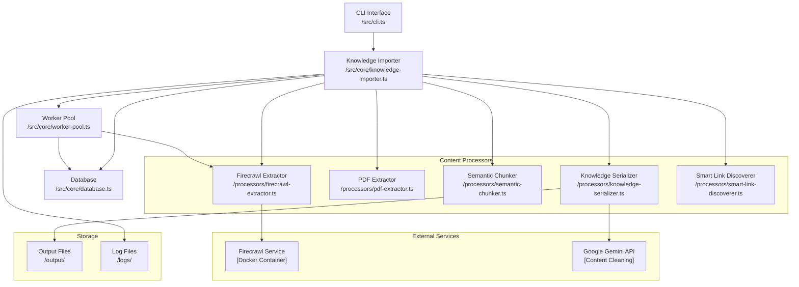

# Web Scraper

A powerful web scraping tool designed to automatically ingest technical knowledge from blogs, guides, and PDFs into a knowledge base. Built with TypeScript and Node.js, it leverages Firecrawl for efficient web crawling and various processors for content extraction and processing.

## Product Architecture



### Key Components

1. **Core Components**
   - Knowledge Importer: Orchestrates content extraction and processing
   - Worker Pool: Manages parallel processing with automatic retries
   - Database: Tracks job states and processing metadata

2. **Content Processors**
   - Firecrawl Extractor: Web content extraction
   - PDF Extractor: PDF document processing
   - Semantic Chunker: Content segmentation
   - Knowledge Serializer: Output formatting
   - Smart Link Discoverer: Enhanced URL discovery

3. **External Services**
   - Firecrawl Service (Docker): High-performance web crawling
   - Google Gemini API: Content cleaning and enhancement


## Initial Setup

1. **Clone the Repository**
```bash
git clone https://github.com/Sharathchenna/web-scraper
cd web-scraper
npm install
```

2. **Environment Setup**
```bash
cp .env.example .env
```
- Open the `.env` file and update:
  - `GEMINI_API_KEY` with your API key
  - `DEFAULT_TEAM_ID` as needed

3. **Build the Project**
```bash
npm run build
```

4. **Setup Firecrawl (Required)**
- Ensure Docker is running on your system
```bash
git clone https://github.com/mendableai/firecrawl
cd firecrawl
docker compose up
```

## CLI Commands

The CLI tool is built into the `dist/cli.js` file. Before using any commands, make sure to:
1. Run `npm run build` to compile the TypeScript code
2. Have your `.env` file properly configured

### Available Commands

1. **Crawl a Website**
```bash
node dist/cli.js crawl <rootUrl> --team <teamId> [options]

Options:
  --team <teamId>         Team ID for the knowledge base (required)
  --user <userId>         User ID for the knowledge base items
  --depth <number>        Maximum crawl depth (default: 3)
  --max-pages <number>    Maximum number of pages to crawl (default: 50)
  --exclude <patterns>    Patterns to exclude from crawling
  --include <patterns>    Patterns to include in crawling
  --output <dir>         Output directory for results
  --verbose              Enable verbose logging
```

2. **Extract Single URL**
```bash
node dist/cli.js single <url> --team <teamId> [options]

Options:
  --team <teamId>     Team ID for the knowledge base (required)
  --user <userId>     User ID for the knowledge base items
  --output <dir>      Output directory for results
  --verbose          Enable verbose logging
```

### Example Usage

```bash
# Crawl a website (most common use case)
node dist/cli.js crawl https://quotes.toscrape.com/ --team quill_smart --max-pages 10 --verbose

# Extract a single page
node dist/cli.js single https://example.com/blog-post --team your_team_id --verbose

# Crawl with custom depth and exclude patterns
node dist/cli.js crawl https://example.com \
  --team your_team_id \
  --depth 5 \
  --max-pages 20 \
  --exclude "**/admin/**" "**/login/**" \
  --verbose
```

### Output

The commands will generate:
- JSON files in the configured output directory (default: `./output`)
- Summary markdown files for each extraction
- Console output showing:
  - Title and metadata of extracted content
  - Word count and reading time estimates
  - Processing statistics
  - Any errors or warnings

> Note: The `--verbose` flag is recommended for debugging as it provides detailed logging of the extraction process.

## Requirements

- Node.js >= 20.0.0
- Docker (for Firecrawl)

## Project Structure
```
internship-assignment-2/
├── data/               # Data storage
├── logs/              # Application logs
├── output/            # Output files and summaries
├── src/
│   ├── cli.ts         # CLI implementation
│   ├── core/          # Core functionality
│   ├── processors/    # Content processors
│   ├── schemas/       # Data schemas
│   ├── types/         # TypeScript type definitions
│   └── utils/         # Utility functions
├── test/              # Test files
└── temp/              # Temporary files
```

## Dependencies

### Main Dependencies
- `@google/genai` - Google's Generative AI SDK
- `@mendable/firecrawl-js` - Web crawling engine
- `playwright` - Browser automation
- `pdf-parse` - PDF parsing
- `winston` - Logging

### Development Dependencies
- TypeScript
- Jest for testing
- ESLint for linting
- Prettier for code formatting

## License

MIT License - see LICENSE file for details
