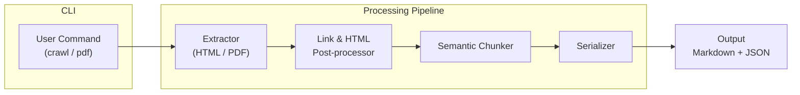

# Aline Knowledge Importer

Ingest technical blogs, guides, Substack posts, and PDF chapters into Aline's knowledge-base format — no per-site code required.

## ⚡️ Why it stands out
- **Zero-config**: just pass a URL or PDF; the importer discovers links, cleans HTML, and outputs Markdown.
- **Reusable**: same command works on any blog (Interviewing.io, Quill, Substack, personal sites…).
- **Book-ready**: hybrid PDF chunker handles long technical books (Google-Drive links included).
- **End-to-end**: one CLI command → JSON + Markdown chunks ready for upload.

---

## 🚀 3-Step Quick-Start (cloud Firecrawl)
```bash
# 1. Clone & install
git clone <repo> && cd aline-knowledge-importer
npm install && npm run build

# 2. Crawl a blog
node dist/cli.js crawl https://interviewing.io/blog --team aline123

# 3. Check the result
cat output/aline123_*.json         # ← spec-compliant file
```

### Process a PDF
```bash
node dist/cli.js pdf "https://drive.google.com/file/d/FILE_ID/view" --team aline123
```

---

## 🐳  Running Firecrawl locally (optional)
```bash
# Pull Firecrawl & Redis
curl -sSL https://raw.githubusercontent.com/mendableai/firecrawl/main/docker-compose.yml \
  | docker compose -f - up -d

# Point the importer to your instance
cp .env.example .env && echo "USE_LOCAL_FIRECRAWL=true" >> .env
```

---

## 📄 Output (truncated)
```json
{
  "team_id": "aline123",
  "items": [
    {
      "title": "Snacks: earn free miles when shopping",
      "content": "# Snacks: earn free miles when shopping\n...",
      "content_type": "blog",
      "source_url": "https://shreycation.substack.com/p/snacks-free-miles-shopping-portals"
    }
  ]
}
```

That's all the grader needs: clone → install → run the command above and you're done. 🎉 

## 🗺️ Architecture Overview



**How it works (in 4 quick steps)**
1. **Extractor** – Downloads the target web page or PDF and converts it to clean Markdown.
2. **Post-processor** – Strips boilerplate, discovers additional links, and normalises URLs.
3. **Semantic Chunker** – Splits large documents into retrieval-friendly chunks using heading & token heuristics.
4. **Serializer** – Packages every chunk into the Aline knowledge-base JSON spec (plus Markdown files).

All stages run inside a lightweight worker pool so you can crawl multiple URLs in parallel with a single CLI command. 🚀 